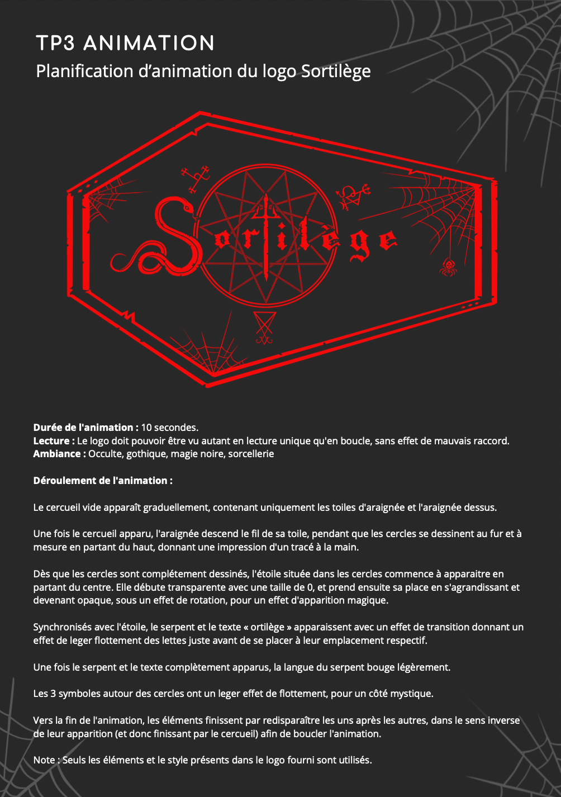

# Description 

Projet réalisé dans le cadre de mon AEC en développement web. 

Il s'agissait de proposer des idées d'amination du logo ci-dessous, fourni par le professeur, et de les réaliser en utilisant le logiciel After Effect :

# Table des matières

1. [Planification de l'animation](#planification-de-lanimation)
2. [Résultat](#résultat)

# Planification de l'animation

# Résultat

